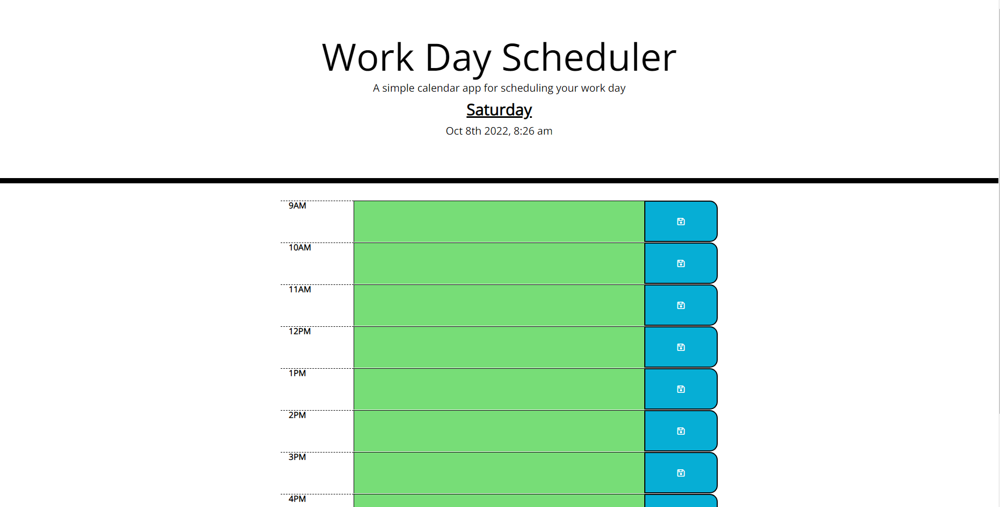

# Work-Day Scheduler!

This is an application to keep a log of your schedule during a work day.

[Deployed Application](https://dcrowdev.github.io/challenge05-Work-Day-Scheduler/)

## Description

The work-day scheduler application allows the user to input their schedule on an hour-by-hour timeblock.  
It is color coated to easily show your schedule time relative to the current time.  
It also stores your schedule data locally, so you can leave the page and return without losing your schedule!

### Installing

No installation required! Application runs on browser.

### Executing program

Simply type in your schedule for that time of the day and click the blue save button!  
If you want to clear your entire schedule, click the "Clear Schedule" button at the bottom!

## Authors

Dylan Crowley:

[Github](https://github.com/dcrowdev)  
[Twitter](https://twitter.com/dcrowdev)  
[LinkedIn](https://www.linkedin.com/in/dylan-crowley-3974b8252/)  
dcrowdev1025@gmail.com

## License

This project currently has no license.

## Acknowledgments

Thanks to my classmates for collaborating on homework assignments!
